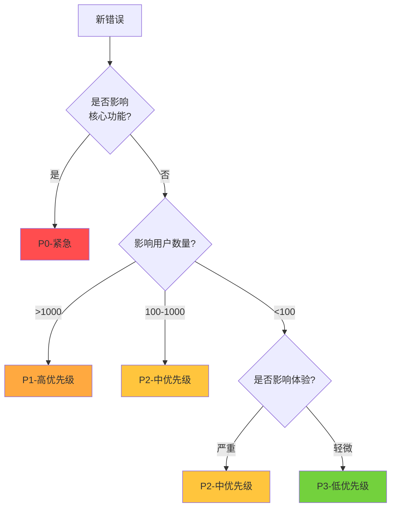
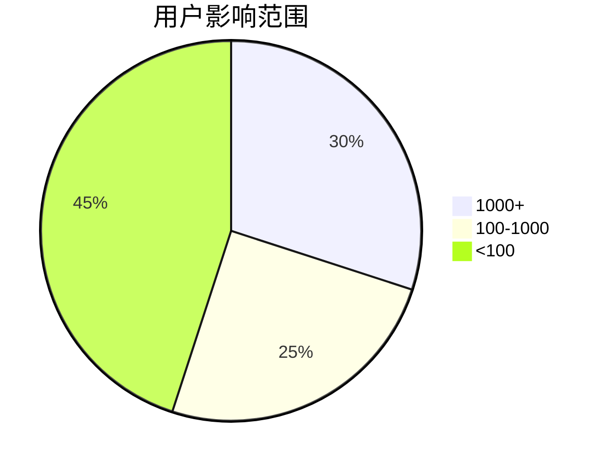
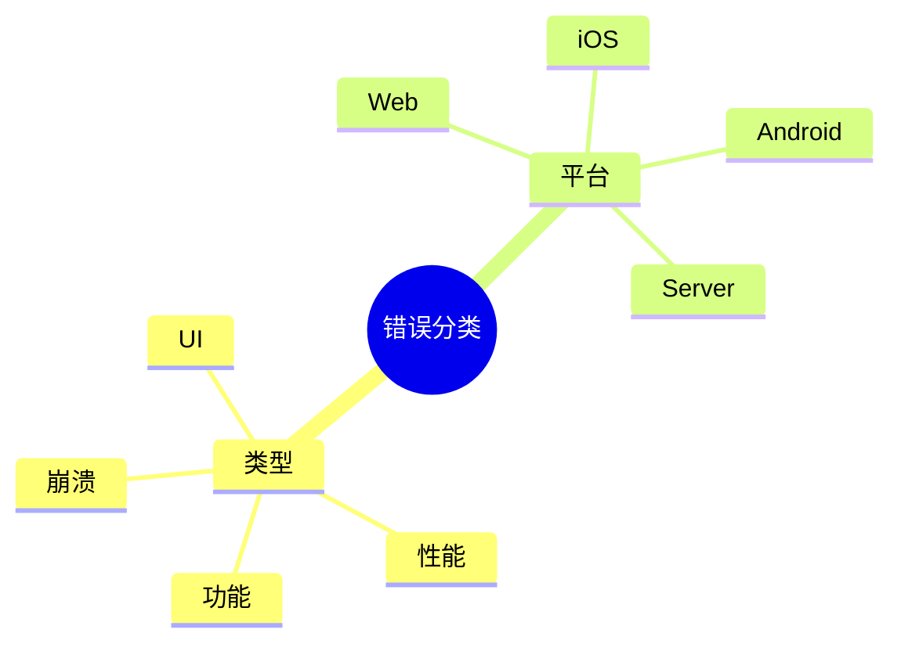
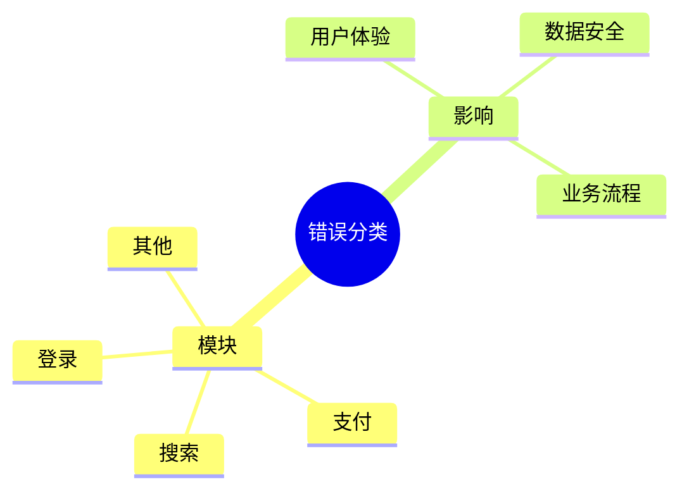
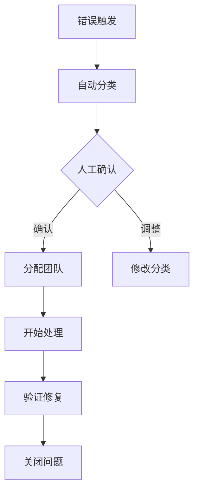

# Sentry 错误分类决策树
## 高效的错误分类与处理流程

<div class="opacity-80">
让错误处理更简单、更高效
</div>

---
layout: default
---

# 错误分类决策树



---
layout: default
---

# 优先级说明

<div class="grid grid-cols-2 gap-4">

<div>

### 🔴 P0 - 紧急
- 核心功能故障
- 立即响应（5分钟内）
- 全团队支援

### 🟠 P1 - 高优先级
- 重大业务影响
- 30分钟内响应
- 2小时内修复

</div>

<div>

### 🟡 P2 - 中优先级
- 一般功能影响
- 2小时内响应
- 24小时内修复

### 🟢 P3 - 低优先级
- 轻微问题
- 24小时内响应
- 下个迭代修复

</div>

</div>

---
layout: default
---

# 影响范围评估



---
layout: default
---

# 处理时效矩阵

| 优先级 | 响应时间 | 修复时限 | 跟进频率 |
|--------|----------|----------|----------|
| P0 | 5分钟 | 2小时 | 30分钟 |
| P1 | 30分钟 | 4小时 | 1小时 |
| P2 | 2小时 | 24小时 | 4小时 |
| P3 | 24小时 | 下个迭代 | 每日 |

---
layout: default
---

# 错误属性分类



---
layout: default
---

# 错误属性分类（续）



---
layout: default
---

# 错误特征匹配

```javascript
// 错误类型判断
if (error.type === 'NetworkError') {
  return 'P2-网络错误';
}

// 错误消息匹配
if (error.message.includes('timeout')) {
  return 'P2-超时错误';
}

// 错误堆栈分析
if (error.stack.includes('payment')) {
  return 'P1-支付相关';
}
```

---
layout: default
---

# 影响度判断

```javascript
// 用户数量判断
if (error.userCount > 1000) {
  return 'P1-大规模影响';
}

// 错误频率判断
if (error.frequency > 100/hour) {
  return 'P1-高频错误';
}

// 核心功能判断
if (error.component === 'core') {
  return 'P0-核心故障';
}
```

---
layout: default
---

# 处理流程



---
layout: default
---

# 关键节点检查项

### 1. 错误发现
- 自动告警是否及时
- 错误信息是否完整

### 2. 分类确认
- 优先级是否合适
- 分类是否准确

---
layout: default
---

# 关键节点检查项（续）

### 3. 处理过程
- 团队是否响应
- 修复方案是否合理

### 4. 验证确认
- 修复是否有效
- 是否有遗留问题

---
layout: default
---

# 持续优化

<div class="p-4 border rounded">
<h3>📈 持续优化</h3>

- 定期优化分类规则
- 更新错误知识库
- 跟踪分类准确度
</div>

---
layout: default
---

# 团队协作

<div class="p-4 border rounded">
<h3>🤝 团队协作</h3>

- 明确责任分工
- 保持沟通顺畅
- 定期复盘改进
</div>

---
layout: default
---

# 重点关注

<div class="p-4 border rounded">
<h3>🎯 重点关注</h3>

- 核心功能监控
- 用户反馈收集
- 性能指标跟踪
</div>

---
layout: default
---

# 效果度量

### 📊 关键指标
- 平均响应时间
- 问题解决率
- 分类准确度
- 用户满意度

---
layout: end
---

# 谢谢

<div class="opacity-80">
持续改进，追求卓越
</div>