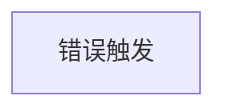
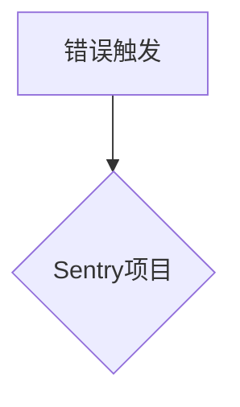
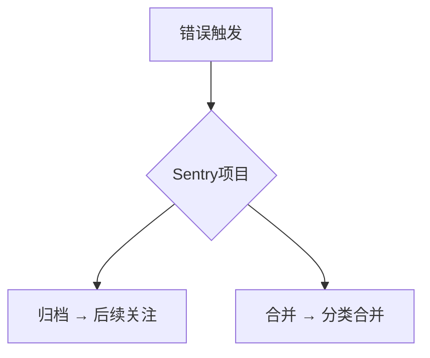
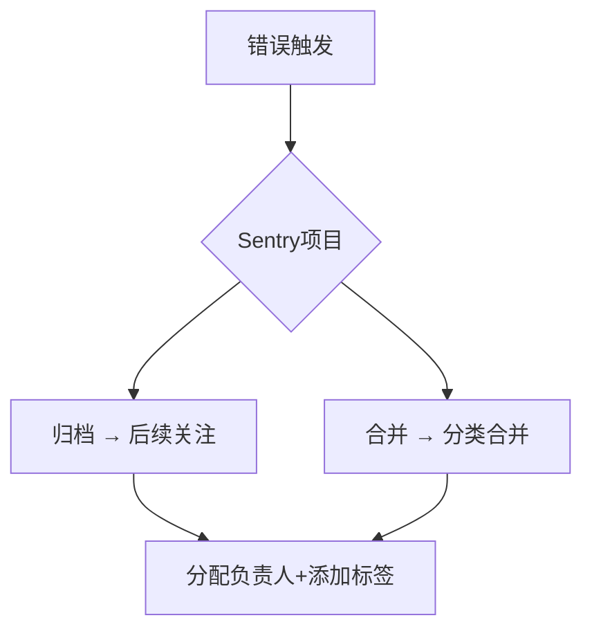
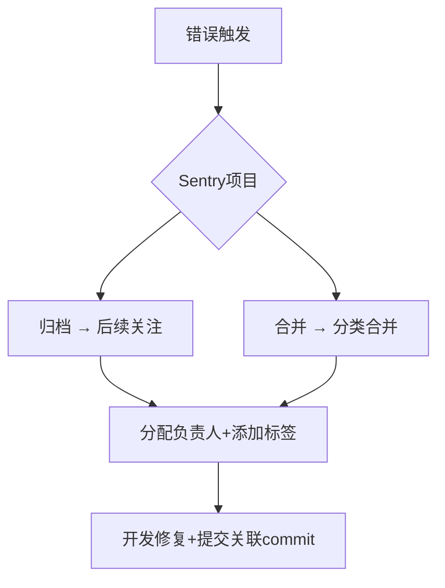
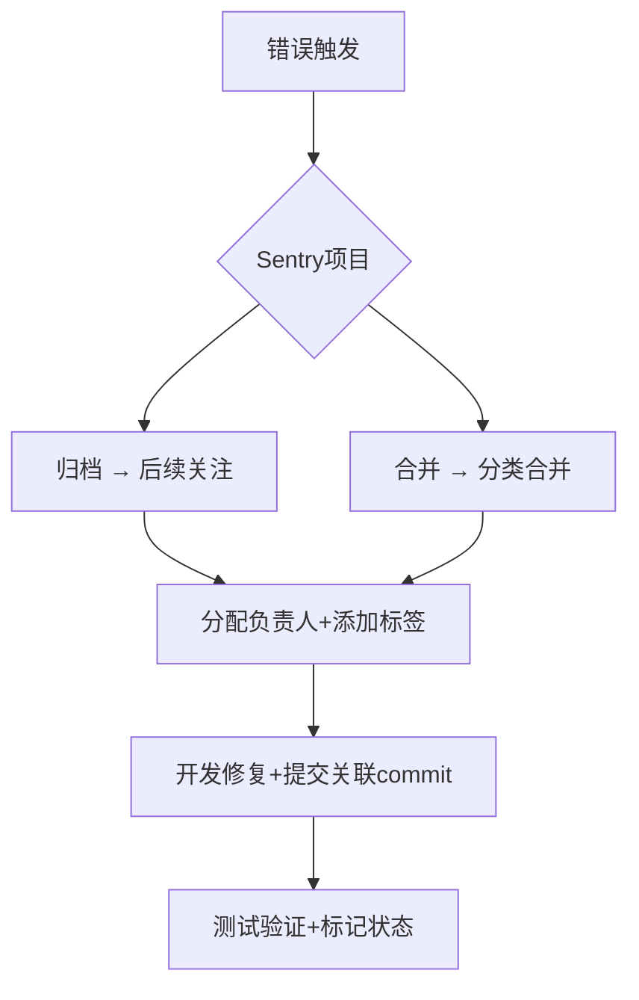
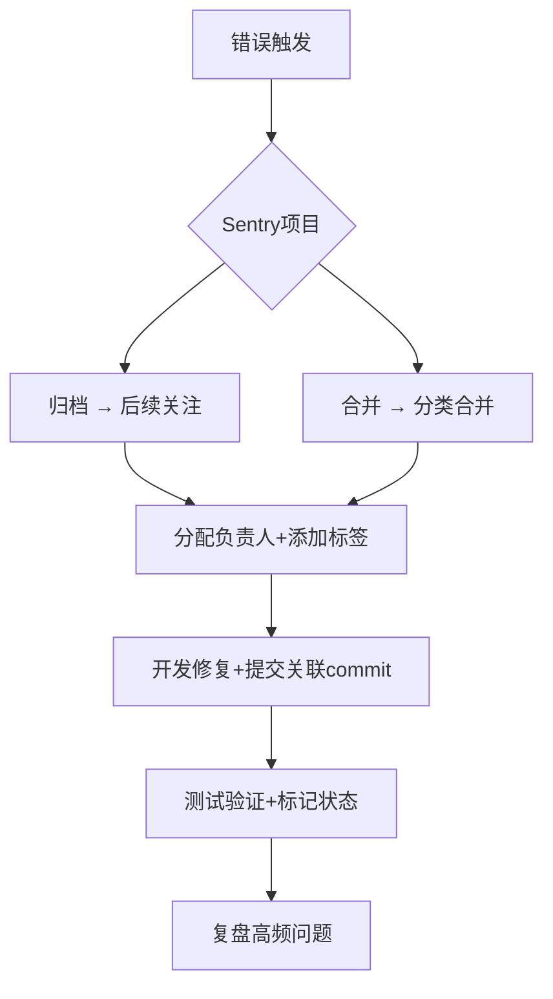

<div class="w-full h-full p-0 bg-black bg-opacity-70">
  <h1 class="absolute w-full text-center  top-[calc(50%-40px)]">Sentry：软件错误监控与协作</h1>
  <div class="font-700 absolute bottom right-20 bottom-5">王浩</div>
</div>


<style>
.slidev-layout {
  padding: 0;
}
.slide-content {
  font-size: 24px;
  line-height: 1.6;
}

.slide-content h2 {
  font-size: 36px;
  margin-bottom: 0.8em;
  color: #2563eb;
}

.slide-content h3 {
  font-size: 28px;
  color: #374151;
  margin: 1em 0 0.5em;
}

.slide-content ul {
  list-style-type: disc;
  margin-left: 32px;
}

.slide-content code {
  background-color: #f3f4f6;
  padding: 2px 6px;
  border-radius: 4px;
  font-size: 0.9em;
}

.slide-content pre {
  background-color: #1e293b;
  color: #e2e8f0;
  padding: 16px;
  border-radius: 8px;
  overflow-x: auto;
}

.slide-content pre code {
  background-color: transparent;
  padding: 0;
}

.slide-content table {
  width: 100%;
  border-collapse: collapse;
}

.slide-content th,
.slide-content td {
  padding: 12px;
  border: 1px solid #e5e7eb;
}

.slide-content th {
  background-color: #f8fafc;
}
</style>

---
layout: default
title: 目录
---

- Sentry 核心价值 (5分钟)
- 全栈集成演示 (5分钟)
- 团队协作工作流 (10分钟)
- 最佳实践 (10分钟)
- 问答与后续计划 (5分钟)

---
layout: intro-image-right
class: slide-content
title: Sentry 核心价值
image: https://images.unsplash.com/photo-1526498460520-4c246339dccb?q=80&w=2070&auto=format&fit=crop&ixlib=rb-4.0.3&ixid=M3wxMjA3fDB8MHxwaG90by1wYWdlfHx8fGVufDB8fHx8fA%3D%3D
---

## Sentry 核心价值

<v-clicks>

*   **跨平台监控:** Web / App / Server
*   **实时错误捕获与智能聚合:** 快速发现和定位问题
*   **完整的上下文信息:** 设备 / OS / 堆栈 / 用户行为 / 日志，助力问题分析
*   **性能监控与用户体验优化:** 了解应用性能瓶颈
*   **与主流技术栈无缝集成:** JS / Go / Dart / / PHP / Kotlin / Python / Native(QT/C++) / Rust 等

</v-clicks>

<!--
Note:
- 跨平台监控：
  - 我们的软件产品覆盖多个平台，每个平台都需要错误监控
  - Sentry 一站式解决方案，不用配多个监控工具
  - 统一的错误报告格式，方便团队协作

- 实时错误捕获：
  - 生产环境出现问题，秒级通知到相关团队
  - 智能分组功能避免重复报警，同类错误自动合并，也支持手动合并
  - 可以第一时间了解影响范围，及时止损

- 上下文信息：
  - 不用再问用户"你用的什么手机？什么系统？"
  - 错误发生时的完整现场还原，包括用户的操作路径，如果有交互页面，甚至可以查看用户的实时操作
  - 特别是移动端，设备信息、网络状态一目了然

- 性能监控：
  - 除了错误，还能监控性能指标
  - 页面加载速度、接口响应时间等
  - 可以帮助我提前发现性能瓶颈

- 技术栈集成：
  - 主流框架都有官方 SDK
  - 配置简单，几行代码就能接入
  - 支持自定义扩展，满足特殊需求
-->

---
layout: default
class: slide-content
title: 全栈集成演示
---

### 前端示例 (Vue)

````md magic-move
```ts
import * as Sentry from "@sentry/vue";
Sentry.init({
  dsn: "your_dsn",
});
```
```ts {4-7} // [!code hl]
import * as Sentry from "@sentry/vue";
Sentry.init({
  dsn: "your_dsn",
  integrations: [
    new Sentry.BrowserTracing(),
  ],
  tracesSampleRate: 0.2,
});
```

```ts {6}
import * as Sentry from "@sentry/vue";
Sentry.init({
  dsn: "your_dsn",
  integrations: [
    new Sentry.BrowserTracing(),
    new Sentry.Replay(), // 重现功能
  ],
  tracesSampleRate: 0.2,
});

```

```ts {9}
import * as Sentry from "@sentry/vue";
Sentry.init({
  dsn: "your_dsn",
  integrations: [
    new Sentry.BrowserTracing(),
    new Sentry.Replay(), // 重现功能
  ],
  tracesSampleRate: 0.2,
  environment: process.env.NODE_ENV, // 环境信息
});
```

```ts {10}
import * as Sentry from "@sentry/vue";
Sentry.init({
  dsn: "your_dsn",
  integrations: [
    new Sentry.BrowserTracing(),
    new Sentry.Replay(), // 重现功能
  ],
  tracesSampleRate: 0.2,
  environment: process.env.NODE_ENV, // 环境信息
  release: "my-project@1.0.0" // 版本信息
});
```

```ts  {11-15}
import * as Sentry from "@sentry/vue";
Sentry.init({
  dsn: "your_dsn",
  integrations: [
    new Sentry.BrowserTracing(),
    new Sentry.Replay(), // 重现功能
  ],
  tracesSampleRate: 0.2,
  environment: process.env.NODE_ENV, // 环境信息
  release: "my-project@1.0.0" // 版本信息
});
try {
  riskyOperation();
} catch (e) {
  Sentry.captureException(e);
}
```
````

<!--
Note:
1. 在Sentry中，一个基本的连接只需要安装sdk，调用初始化 init 方法即可，这里的dsn即项目创建时的dsn

2. 接下来，我们想要开启监控，则需要引入集成 integrations。比如基本的Tracing ，也就是错误跟踪功能。这里是浏览器端，所以是BrowserTracing

3. 再比如：Replay：重现功能，可以辅助重现用户的操作

4. 在开发和测试时，有时候需要区分环境，那么你可以指定环境信息environment，从而区分开发环境、测试环境和生产环境

5. 最后，还可以指定版本信息，便于问题跟进

6. 接入之后，可以用一个简单的用例，测试一下集成的情况
-->

---
layout: default
class: slide-content
title: 全栈集成演示
---
### 后端示例 (Golang)

```go
import "github.com/getsentry/sentry-go"

func main() {
  sentry.Init(sentry.ClientOptions{
    Dsn: "your_dsn",
    Environment: "production",
    Release: "backend@v1.2.0",
    AttachStacktrace: true,
  })

  http.HandleFunc("/api", func(w http.ResponseWriter, r *http.Request) {
    defer sentry.Recover()
    // 业务代码
  })
}
```


---
layout: default
class: slide-content
title: 异常监控最佳实践
---

*   **环境隔离:** 区分 `production` / `staging` / `development`
*   **敏感信息过滤:** 配置 `dataScrubber` 过滤 token / 身份证等
*   **自定义上下文:** 提供更丰富的问题信息

    ```javascript
    Sentry.setContext("payment", {
      transaction_id: "tx_123",
      amount: 99.99
    });
    ```
*   **版本追踪:** 关联 git commit 自动生成 release
*   **性能监控:** 接口耗时 / 页面加载 / FCP 等核心指标
*   **告警策略:** 按错误量 / 影响用户数 / 崩溃率设置阈值


---
title: 团队协作工作流 - 错误触发
layout: center
---

<div class="absolute top-10 left-10"><h2>团队协作工作流</h2></div>



<!-- 
Note:
错误触发：首先，错误可能来自用户的实际操作，也可能是系统自动检测到的异常，比如页面崩溃或API超时等。
 -->

---
layout: center
class: slide-content
title: 团队协作工作流 - 错误上传
---

<div class="absolute top-10 left-10"><h2>团队协作工作流</h2></div>


<!-- 
Note:
错误上传：当错误发生后，Sentry SDK 会自动将这些错误信息上传到我们的 Sentry 平台。这个过程是实时的，通常在几秒内就能收到告警，包含了完整的错误上下文信息。
 -->

---
layout: center
class: slide-content
title: 团队协作工作流 - 错误分类
---

<div class="absolute top-10 left-10"><h2>团队协作工作流</h2></div>


<!-- 
Note:
错误分类：错误进入系统后，我们需要进行初步分类。对于暂时不急需处理的问题，可以先归档；而对于重复出现的相似问题，我们可以合并处理，提高效率。
 -->

---
layout: center
class: slide-content
title: 团队协作工作流 - 分配处理
---

<div class="absolute top-10 left-10"><h2>团队协作工作流</h2></div>


<!-- 
Note:
分配处理：分类后，我们会给问题分配负责人和标签。比如前端问题分给前端团队，API错误分给后端团队。这里可以配置自动分配规则，提高效率。
 -->

---
layout: center
class: slide-content
title: 团队协作工作流 - 开发修复
---

<div class="absolute top-10 left-10"><h2>团队协作工作流</h2></div>


<!-- 
Note:
开发修复：负责人接到任务后，就开始进行问题修复。修复时要关联对应的 commit，这样可以方便后续追踪和回溯问题。
 -->

---
layout: center
class: slide-content
title: 团队协作工作流 - 测试验证
---

<div class="absolute top-10 left-10"><h2>团队协作工作流</h2></div>


<!-- 
Note:
测试验证：修复完成后，需要测试团队进行验证。验证通过后，我们会更新问题状态，确保问题被彻底解决。
 -->

---
layout: center
class: slide-content
title: 团队协作工作流 - 复盘总结
---

<div class="absolute top-10 left-10"><h2>团队协作工作流</h2></div>


<!-- 
Note:
复盘总结：最后是复盘环节。我们会定期分析高频问题，找出共性问题，制定系统性的解决方案，持续优化我们的代码质量。
 -->


---
layout: default
title: 对于不同角色的价值点
---

<div class="absolute top-10 left-10"><h2>价值: 不同角色</h2></div>

*   **测试工程师:** 直接获取复现步骤 / 设备信息
*   **后端工程师:** 查看完整请求参数 / 数据库查询
*   **客户端工程师:** 获取设备内存 / CPU 状态快照
*   **算法工程师:** 监控模型输入输出异常值
*   **技术负责人:** 通过 Trends 分析技术债务分布

---
layout: default
class: slide-content
title: 效果衡量指标 - 举例
---

<div class="absolute top-10 left-10"><h2>展望: BUG立减百分百</h2></div>

*   生产环境崩溃率下降目标 (< 0.1%)
*   错误响应平均时间 (MTTA < 2小时)
*   问题解决周期 (MTTR < 8小时)
*   关键路径错误检测率 (100%覆盖)


---
layout: center
title: 协作工具整合 - 示例
---

<div class="absolute top-10 left-10"><h2>展望：协作工具整合</h2></div>

<v-clicks>

*   错误自动同步到 [飞书](https://juejin.cn/post/7143142055294795807)
*   使用 Sentry 评论功能进行技术讨论
*   通过 `#fingerprint` 手动合并相似问题
*   配置每日自动报表发送到团队群组

</v-clicks>


---
layout: default
class: slide-content
title: 分享后提供
---

*   各平台标准配置文档
*   团队 Sentry 权限矩阵
*   紧急问题处理 SOP
*   错误分类决策树图表

---
layout: default
class: slide-content
title: 问答与后续计划
---

*   欢迎提问！

```

**建议：**

*   在分享之前，务必将代码示例中的 `your_dsn` 替换成你自己的 Sentry DSN。
*   根据团队的实际情况，调整问题分类标准和响应时效。
*   分享时可以结合实际案例，让大家更好地理解 Sentry 的价值。
*   鼓励大家积极参与讨论，提出问题和建议。

希望这个 PPT 对你有所帮助！
